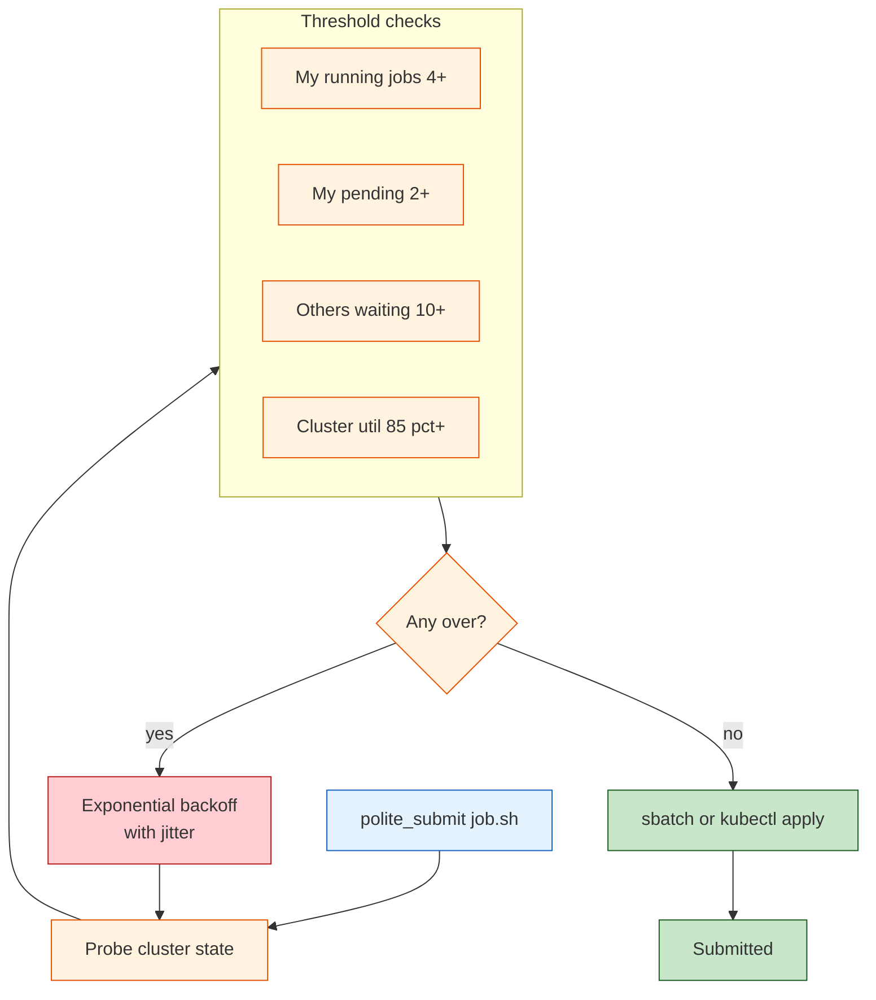

# polite_submit

[](https://github.com/ahb-sjsu/polite-submit/actions/workflows/ci.yml)
[](https://www.python.org/downloads/)
[](https://opensource.org/licenses/MIT)
[](https://doi.org/10.5281/zenodo.20660157)

Client-side contention management for Slurm HPC clusters using CSMA/CA-inspired backoff.

## Overview

`polite_submit` probes cluster state before job submission and backs off when resources are congested, improving queue health for all users without requiring scheduler modifications.

**Key Features:**
- Reduces queue congestion from batch job floods
- Zero server-side changes required (pure client)
- Drop-in replacement for `sbatch`
- Configurable politeness levels
- Supports batch and array job chunking
- Exponential backoff with jitter (like WiFi CSMA/CA)

## Installation

```bash
pip install polite_submit
```

Or from source:

```bash
git clone https://github.com/ahb-sjsu/polite-submit
cd polite-submit
pip install -e .
```

## Quick Start

```bash
# Single job
polite_submit job.sh

# Multiple scripts
polite_submit --batch job1.sh job2.sh job3.sh

# Array job in chunks
polite_submit --array sweep.sh --range 0-99 --chunk 10

# Dry run (see what would happen)
polite_submit --dry-run job.sh

# Skip politeness (late night, aggressive mode)
polite_submit --aggressive job.sh

# Kubernetes job on NRP Nautilus (auto-detected from .yaml extension)
polite_submit --backend k8s --namespace my-ns training-job.yaml
```

## How It Works

Before each submission, `polite_submit`:

1. **Probes cluster state**
   - **Slurm**: `sinfo` for partition load, `squeue` for your jobs and
     pending queue.
   - **Kubernetes**: `kubectl top nodes` (or `kubectl get nodes` if
     metrics-server is unavailable) for utilization, `kubectl get jobs
     -n <ns>` for your jobs, and `kubectl get pods --all-namespaces
     --field-selector=status.phase=Pending` for queue depth.
2. **Checks thresholds:**
   - Am I running too many jobs? (default: 4)
   - Do I have too many pending? (default: 2)
   - Are others waiting? (default: threshold 10)
   - Is cluster utilization high? (default: 85%)
3. **If any threshold exceeded:** Back off with exponential delay.
4. **If clear:** Submit via the configured backend (`sbatch` or
   `kubectl apply`).

This mirrors CSMA/CA (Carrier-Sense Multiple Access with Collision
Avoidance) from WiFi protocols.



### Kubernetes / NRP Nautilus

polite_submit works with any Kubernetes cluster where you can run
`kubectl`. For the NRP Nautilus cluster specifically, reasonable
starting thresholds:

```yaml
cluster:
  backend: k8s
  namespace: your-namespace
politeness:
  max_concurrent_jobs: 50       # Nautilus is big
  max_pending_jobs: 20
  queue_depth_threshold: 200    # cluster-wide pending pods tolerated
  utilization_threshold: 0.90
```

If your cluster role does not grant cluster-wide pod read access, the
`others_pending` signal silently degrades to 0; the decider then
relies on your self-limiting thresholds + node utilization alone.

## Configuration

Create `~/.polite_submit.yaml` or `polite_submit.yaml` in your working directory:

```yaml
cluster:
  host: hpc                    # SSH host alias (null for local)
  partition: gpu               # Default partition

politeness:
  max_concurrent_jobs: 4       # Max running at once
  max_pending_jobs: 2          # Max waiting in queue
  queue_depth_threshold: 10    # Back off if this many others pending
  utilization_threshold: 0.85  # Back off if cluster this full

peak_hours:
  enabled: true
  schedule:
    - [9, 17]                  # 9 AM - 5 PM
  max_concurrent: 2            # Stricter during peak
  weekend_exempt: true

backoff:
  initial_seconds: 30
  max_seconds: 1800            # 30 minutes
  multiplier: 2.0
  max_attempts: 20
```

## CLI Options

```
Usage: polite_submit [OPTIONS] [SCRIPT]

Options:
  -b, --batch PATH    Submit multiple scripts (can be repeated)
  -a, --array PATH    Submit as array job
  --range TEXT        Array range (e.g., 0-99). Required with --array
  --chunk INTEGER     Chunk size for array jobs
  --aggressive        Skip politeness checks
  -n, --dry-run       Show what would happen without submitting
  -c, --config PATH   Path to config file
  -p, --partition     Override partition
  -H, --host TEXT     SSH host for remote cluster
  --version           Show version
  --help              Show this message
```

## SSH Setup

For remote clusters, configure SSH:

```bash
# ~/.ssh/config
Host hpc
    HostName your-cluster.edu
    User yourusername
    IdentityFile ~/.ssh/id_ed25519
```

Then use:

```bash
polite_submit --host hpc job.sh
```

## Theory: Fairness as Gauge Invariance

This tool implements voluntary compliance with fairness constraints. By limiting your own submissions when others are waiting, you preserve approximate user-permutation invariance—the principle that who you are shouldn't change your expected wait time.

For more on the theoretical foundation, see the [ErisML library](https://github.com/ahb-sjsu/erisml-lib) and the SQND framework.

## License

MIT License
